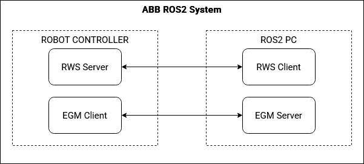

# ABB OMNICORE ROS 2

This is a meta-package containing everything to run an ABB robot with OMNICORE controller with ROS 2.

- `abb_bringup`: Launch files and ros2_control config files that are generic to many types of ABB robots.
- `abb_hardware_interface`: A ros2_control hardware interface using abb_libegm.
- `robot_specific_config`: Packages containing robot description and config files that are unique to each type of ABB robot.
- `abb_resources`: A small package containing ABB-related xacro resources.
- `docs`: More detailed documentation.
- `robot_studio_resources`: Code and a pack-and-go solution to begin using RobotStudio easily.
- `abb_ros2`: A meta-package that exists to reserve the repo name in rosdistro

## Getting Started:

### Installation

```
sudo apt update
sudo apt dist-upgrade
rosdep update
mkdir -p ros2_ws/src && cd ros2_ws/src
git clone https://github.com/cmu-mfi/abb_omnicore_ros2.git -b omnicore
vcs import < abb_omnicore_ros2/abb.repos
rosdep install -r --from-paths . --ignore-src --rosdistro $ROS_DISTRO -y
```

Build the package:

```
cd ros2_ws
colcon build
```

Verify using RViz to view and control simulation robot:

```
ros2 launch abb_bringup abb_bringup.launch.py sim:=true robot_type:=irb1300_7_140 robot_class:=irb1300
```

### Run with Real Robot

* The controller must have RWS 2.0 and EGM option installed and enabled.

* Follow the guides below to setup your controller:
    - [Robot Studio Setup Guide](./RobotStudioSetup.md)
    - [Network Configuration](./NetworkingConfiguration.md)
    - [Troubleshooting](./Troubleshooting.md)

* Test with following:
```
ros2 launch abb_bringup abb_bringup.launch.py sim:=false robot_type:=irb1300_7_140 robot_class:=irb1300 robot_ip:=<controller_ip_address>
```

> ![Note]
> The repository currently does not support MultiMove.


## Contributing

### pre-commit Formatting Checks

This package has a pre-commit check that runs in CI. You can use this locally and set it up to run automatically before you commit something. To install, use pip:

    pip3 install pre-commit

To run over all the files in the repo manually:

    pre-commit run -a

To run pre-commit automatically before committing in a local repo, install git hooks:

    pre-commit install
